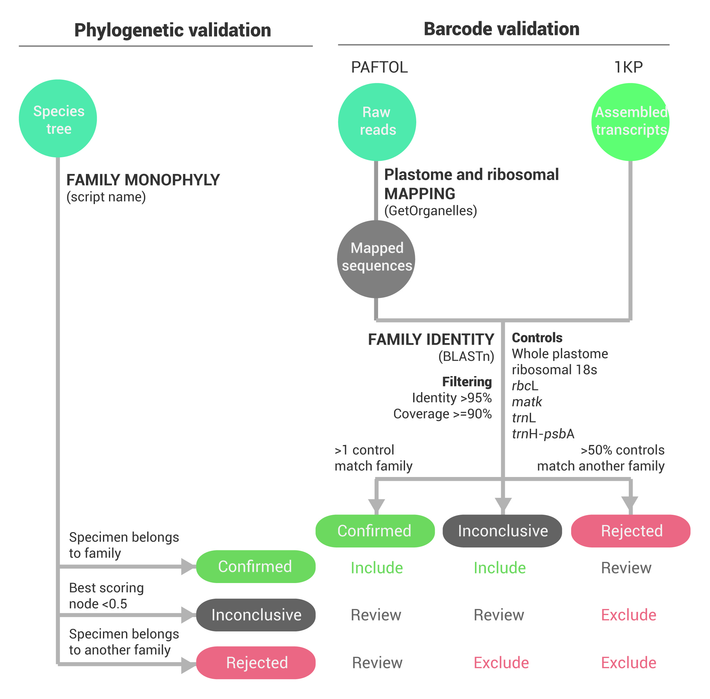

# Validation Pipeline
[TOC]

Samples were validated at family level through 1) in-silico DNA barcoding, and 2) phylogenetic placement.

**1. Barcoding**: Plastomes and ribosomal DNA were recovered from raw reads using GetOrganelle (Jin et al. 2020) and subsequently queried against databases of reference plant barcodes using BLASTn (Camacho et al. 2009). For 1KP samples, transcripts were used as queries. 

**2. Phylogeny placement**: For validating the phylogenetic placement by  assessing which node best represented each taxon, every taxon (at every rank) was mapped onto every node in the tree, and for each combination, two metrics were calculated: firstly, the proportion of specimens belonging to the  taxon that subtend the node, and secondly, the proportion of specimens subtending the node that belong to the taxon. The two metrics were multiplied to produce a combined score, and for each ranked taxon, the best scoring node was subsequently considered to represent the taxon in the tree (allowing the identification of outlying child taxa). A taxon with a best scoring node of value 1 is monophyletic in the tree.




# DNA Barcoding
## Barcode Databases
To improve the testability and accuracy of the validation procedure—due to partial recovery of organellar DNA and uneven coverage across families for reference barcodes—six individual barcode reference databases were built from the NCBI nucleotide and BOLD database (https://www.ncbi.nlm.nih.gov/nuccore; https://www.boldsystems.org/, accessed on 29/10/2020): one for the whole plastome, and the remaining five for particular organellar loci (ribosomal 1 nuclear locus (18s), as well as plastidome loci (rbcL, matk, trnL, and trnH-psbA). 
The creation and curation of barcode databases is described in detail [here](Barcode_Databases/)


## Samples
### PAFTOL
For PAFTOL samples, plastomes and ribosomal DNA were recovered from raw reads using GetOrganelles (Jin et al. 2020). In both cases, recommended parameters were used (https://github.com/Kinggerm/GetOrganelle#recipes; i.e. -R 20 -k 21,45,65,85,105 for plastomes, and -R 10 -k 35,85,115 for nuclear ribosomes).

### 1KP
As 353 target genes were also recovered from transcriptomes of the One Thousand Plant Transcriptomes Initiative (Leebens-Mack et al. 2019), we also performed validation by barcoding on the 766 samples recovered. For the validation, we used the same original transcriptome fasta files as in Paftools retrieve_targets. Note that several 1kp samples have already been flagged as contaminated or mislabelled (Carpenter et al. 2019), with a barcode validation against 18s.

## Taxonomic standardization

Species names in PAFTOL, 1KP and barcode databases were all standardized against the World Checklist of Vascular Plants (https://wcvp.science.kew.org/)  using a [custom python script](WCVP_Taxo/). As such all species reference databases and samples were standardized against the same taxonomy in the validation pipeline.

## Sample Validation
### 1. Blast

Sample sequences were queried against barcode databases using BLASTn (Camacho et al. 2009) if their family was present in the database. BLAST results were further filtered with a minimum identity >95%, minimum length (based on barcode length) and minimum coverage of reference locus >=90%. BLAST matches were then ranked by identity

ADD TABLE

```shell
sbatch blast_barcodes_array_v2.sh /mnt/shared/scratch/kleempoe/paftol/org_barcode/OKP/ okp_data_fasta ../Barcode_DB/db_ls.txt
```

### 2. Test

Up to six tests were thus executed per sample. Matching tests could only be completed if: 1) the specimens’ family were present in barcode databases, 2) at least one BLAST matches remained after filtering. A sample passed a test if its family ranked first in BLAST matches (ranked by identity), and failed otherwise. 

### 3. Validation

Validation by barcoding was then summarized as follow:  

1. Confirmed: One or more tests confirm the family placement of a sample.
2. Rejected: More than ½ of the tests confirm the same incorrect family. Requires at least two tests.
3. Inconclusive otherwise.

## Dependencies

```python
- entrez-direct 
- seqkit
- cutadapt
- blast
- python3
	- Pandas
	- Numpy
	- Bio
	- TQDM
	- Seaborn
```

# Phylogeny Placement
For each family whose best scoring node had a value > 0.5 (excluding monotypic and singly sampled families), specimens belonging to the family and found under this node were coded as **confirmed**, and specimens belonging to the family but not falling under the node were coded as **rejected**. For families whose best scoring node had a value of <= 0.5, the evidence for the description of all specimens belonging to the family was considered **inconclusive**.

# Validation decisions
The outputs of the phylogenetic and barcoding validation were combined to identify specimens for automatic inclusion and exclusion from the final tree, and those where a decision on inclusion/exclusion was subject to expert review (see figure above).