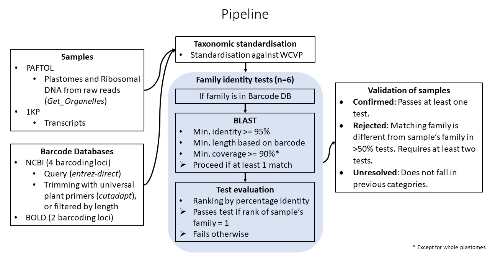

# DNA barcode validation
[TOC]

PAFTOL and 1KP samples were validated through in-silico DNA barcoding.



## Barcode Databases

To improve the testability and accuracy of the validation procedure - due to partial recovery of organellar DNA and uneven coverage across families in reference barcodes - six barcode tests were performed against individual barcode reference databases *that* were built from NCBI nucleotide database (https://www.ncbi.nlm.nih.gov/nuccore) and BOLD (https://www.boldsystems.org/): one for the whole plastome, and the remaining five for particular organellar loci (ribosomal 1 nuclear locus (18s), as well as plastidome loci (rbcL, matk, trnL, and trnH-psbA). Sequences taxonomy was then resolved against WCVP using scientific names. Sequences with unresolved names or that matched duplicate entries with different genera names were discarded.

The creation and curation of barcode databases is described in detail [here](Barcode_Databases/README.md)

## Samples

### PAFTOL

For PAFTOL samples, plastomes and ribosomal DNA were recovered from raw reads using GetOrganelles (Jin et al. 2020). In both cases, recommended parameters were used (https://github.com/Kinggerm/GetOrganelle#recipes; i.e. -R 20 -k 21,45,65,85,105 for plastomes, and -R 10 -k 35,85,115 for nuclear ribosomes).

### 1KP

As 353 target genes were also recovered from transcriptomes of the One Thousand Plant Transcriptomes Initiative (Leebens-Mack et al. 2019), we also performed validation by barcoding on the 766 samples recovered. For the validation, we used the same original transcriptome fasta files as in Paftools retrieve_targets. Note that several 1kp samples have already been flagged as contaminated or mislabelled (Carpenter et al. 2019), with a barcode validation against 18s.

## Taxonomic standardization

Species names in PAFTOL, 1KP and barcode databases were all standardized against the World Checklist of Vascular Plants (https://wcvp.science.kew.org/)  using a custom python script. As such all species reference databases and samples were standardized against the same taxonomy in the validation pipeline.

## Sample Validation
### 1. Blast

Sample sequences were queried against barcode databases using BLASTn (Camacho et al. 2009) if their family was present in the database. BLAST results were further filtered with a minimum identity >95%, minimum length and minimum coverage of reference locus (Table S1). BLAST matches were then ranked by identity

```shell
sbatch blast_barcodes_array_v2.sh /mnt/shared/scratch/kleempoe/paftol/org_barcode/OKP/ okp_data_fasta ../Barcode_DB/db_ls.txt
```

### 2. Test

Up to six tests were thus executed per sample. Matching tests could only be completed if: 1) the specimens’ family were present in barcode databases, 2) at least one BLAST matches remained after filtering. A sample passed a test if its family ranked first in BLAST matches (ranked by identity), and failed otherwise. 

### 3. Validation

Validation by barcoding was then summarized as follow:  

1. Confirmed: One or more tests confirm the family placement of a sample.
2. Rejected: More than ½ of the tests confirm the same incorrect family. Requires at least two tests.
3. Inconclusive otherwise.

## Dependencies

```python
- entrez-direct 
- seqkit
- cutadapt
- blast
- python3
	- Pandas
	- Numpy
	- Bio
	- TQDM
	- Seaborn
```

